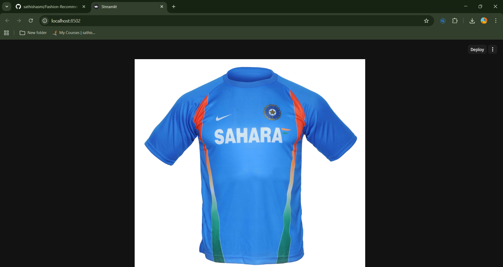
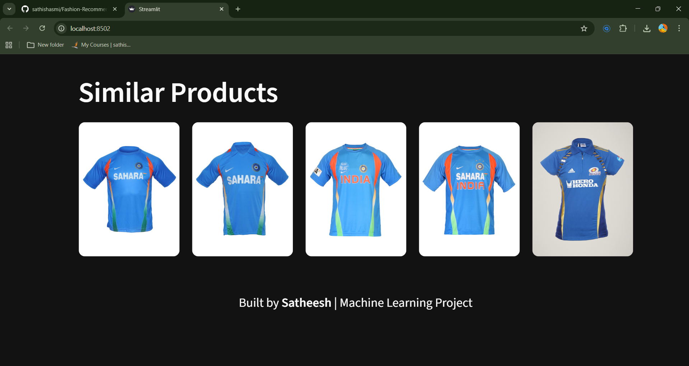
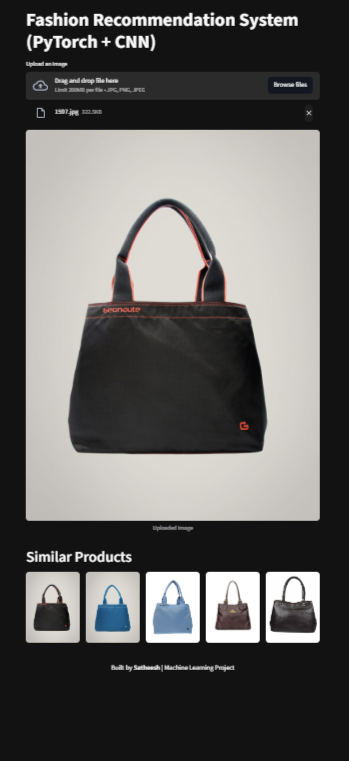
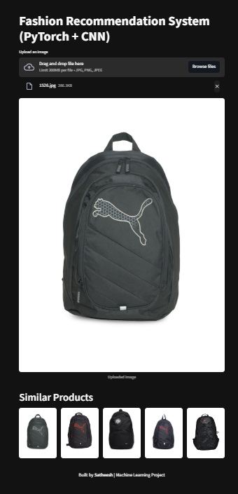
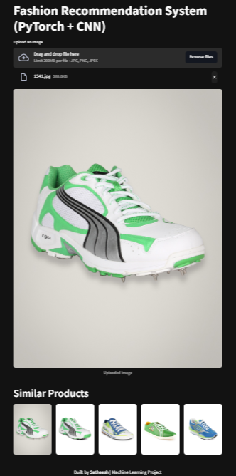

# Fashion Recommendation System (PyTorch + CNN)

A content-based fashion recommendation system that suggests similar clothing items using deep learning.

---

## Features

* Upload an image and get similar fashion products
* Uses **ResNet50 (CNN)** for feature extraction
* Computes similarity using **cosine similarity**
* Built with **PyTorch + Streamlit**
* Fast recommendations using precomputed features

---

## How It Works

1. Image is uploaded by the user
2. Image is preprocessed and passed through a pretrained CNN (ResNet50)
3. Feature vector is extracted
4. Compared with stored features (`features.pkl`)
5. Top similar images are displayed

---

## Project Structure

```
Fashion-Recommendation-System-CNN/
│
├── app/
│   └── app.py                # Streamlit app
│
├── model/
│   ├── features.pkl         # Extracted features
│   └── paths.pkl            # Image paths
│
├── fashion-dataset/
│   └── images/              # Dataset images
│
├── notebooks/
│   └── training.ipynb       # Feature extraction notebook
│
├── requirements.txt
└── README.md
```

---

## Installation

### 1. Clone Repository

```bash
git clone https://github.com/your-username/Fashion-Recommendation-System-CNN.git
cd Fashion-Recommendation-System-CNN
```

---

### 2. Create Virtual Environment

```bash
python -m venv venv
venv\Scripts\activate
```

---

### 3. Install Dependencies

```bash
pip install -r requirements.txt
```

---

## Run the App

```bash
streamlit run app/app.py
```

Then open:

```
http://localhost:8501
```

---
## Demo
Upload a cloth image → system suggests similar cloth image
### Input Image


### Recommendations


### Demo images (output images for other fashion input image)



---

## Tech Stack

* Python
* PyTorch
* Torchvision (ResNet50)
* Streamlit
* NumPy
* Scikit-learn

---

## Future Improvements

* Add FAISS for faster search
* Deploy on Streamlit Cloud
* Improve UI/UX
* Add product details (price, brand)

---

## Author

**Satheesh**
Machine Learning Enthusiast

---

## ⭐ If you like this project

Give it a ⭐ on GitHub!
